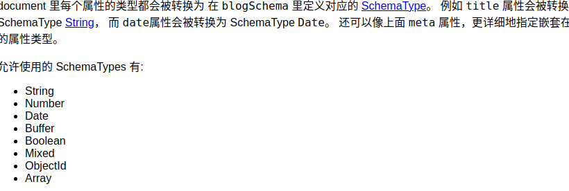

# mongoose的使用

## 1.安装mongoose

创建node.js项目后，安装mongoose：npm install mongoose

要求已经安装并打开了mongodb数据服务器。

## 2.使用流程

1）引入mongoose：

const mongoose = require('mongoose');

2）连接数据库

mongoose.connect('mongodb://localhost/testfer');

其中 testfer是数据表名

3）创建一个schema:

const schema={

​    name:String,

​    age:Number,

​    health:String

}

创建的schema只有在创建model时引用才可以起作用

mongoose有自己的基本数据类型定义:

创建的schema生效后，储存到数据库的数据必须遵守，否则不能储存，但系统没有原生的错误提示，只是储存一个空数据。

4）创建一个model

const Cat = mongoose.model（‘Cat’，schema）；

5）写入数据库

kity1.save()

写入后数据集的名称：是定义model的第一个参数，并进行了修改：保证英文的复数形式（自动在最后加s，如果没有的话。）

6）数据查找

数据集.find({查询条件},callback(err,查询结果)=>{})

查询结果是一个Array，data[0]._doc是查询出的文档。